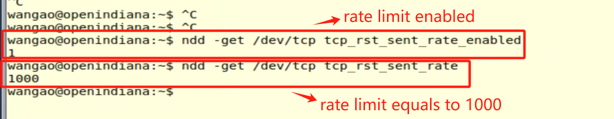
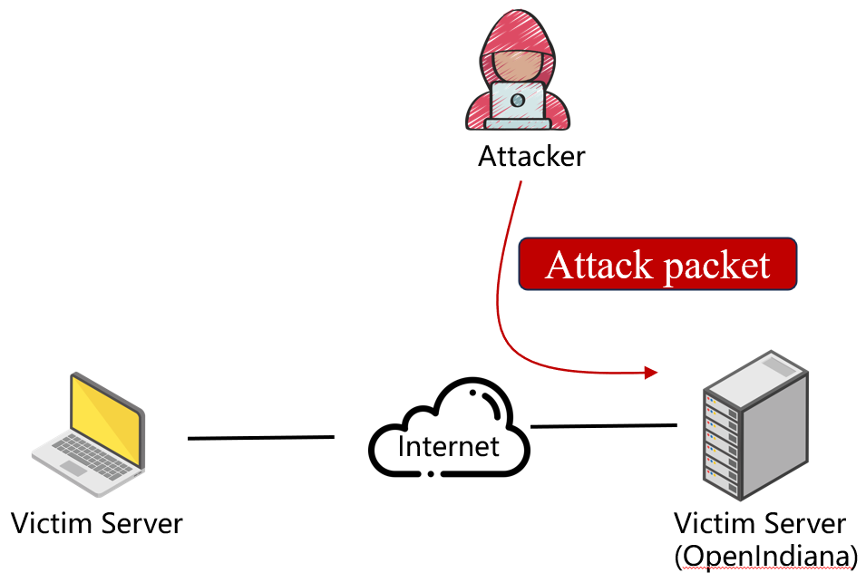
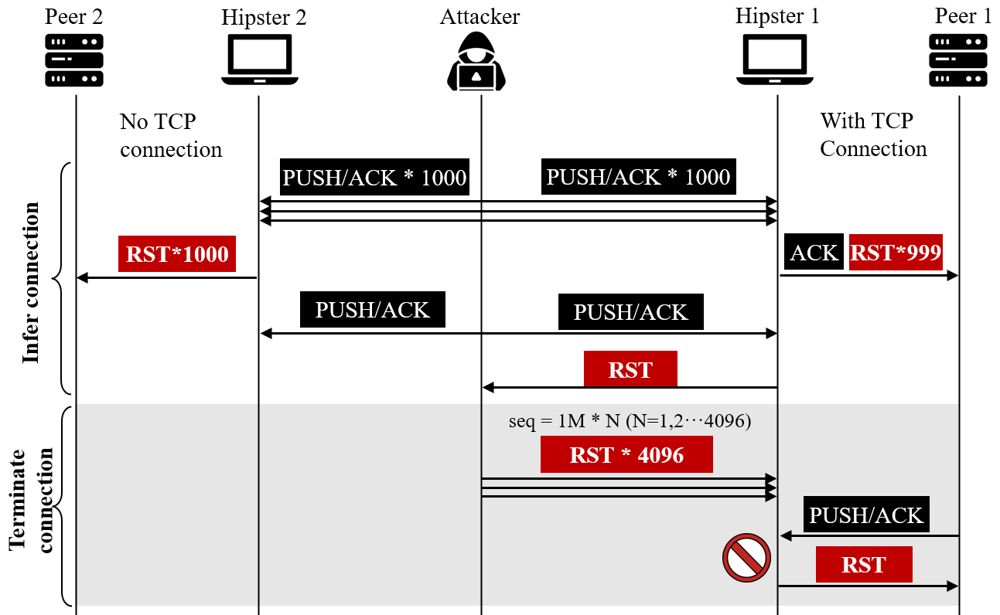
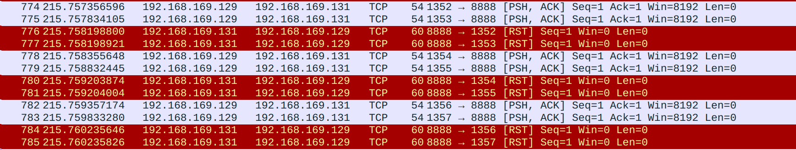
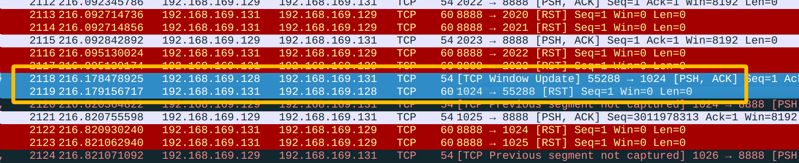
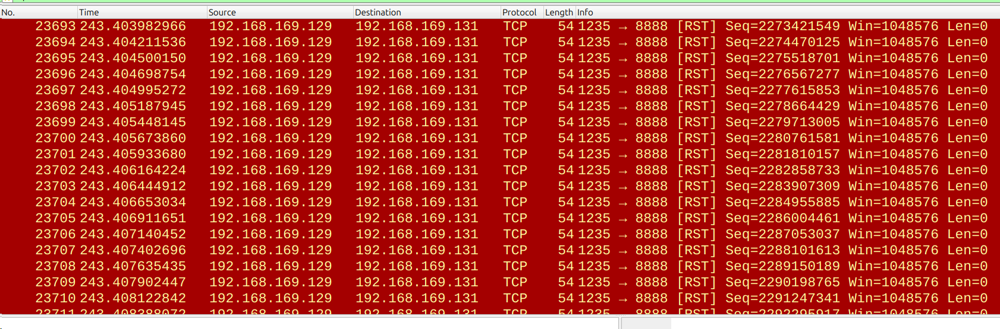
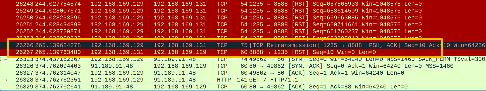

# TCP DoS Vulnerability in OpenIndiana Hipster 2024.10 due to RST Rate Limiting and Improper RFC 5961 Implementation

During our recent research on network protocol stacks, we discovered a security vulnerability in OpenIndiana Hipster 2024.10. The vulnerability originates from a combination of two weaknesses: the global rate-limiting mechanism for RST packets in its TCP/IP stack and the failure to strictly implement RFC 5961 for RST packets. An attacker can first exploit the rate-limiting mechanism to construct a precise side-channel, allowing them to remotely infer the ephemeral port used in a TCP connection. Subsequently, they can leverage the improper RFC 5961 implementation to send a small number of crafted RST packets to terminate the connection, leading to a Denial of Service (DoS).

During our recent research on network protocol stacks, we discovered a security vulnerability in OpenIndiana Hipster 2024.10. The vulnerability originates from a combination of two weaknesses: the global rate-limiting mechanism for RST packets in its TCP/IP stack and the failure to strictly implement RFC 5961 for RST packets. An attacker can first exploit the rate-limiting mechanism to construct a precise side-channel, allowing them to remotely infer the ephemeral port used in a TCP connection. Subsequently, they can leverage the improper RFC 5961 implementation to send a small number of crafted RST packets to terminate the connection, leading to a Denial of Service (DoS).

## 1. Introduction to the Vulnerabilities

### 1.1 RST Rate Limiting and Side-Channel Attacks

The TCP RST packet is a crucial signal used to forcibly terminate a connection. When a host receives a TCP packet for a port that is not being listened on, its kernel protocol stack responds with an RST packet. To defend against DoS attacks and port scanning, OpenIndiana Hipster 2024.10 implements a rate-limiting mechanism for outgoing RST packets. This mechanism sets a global threshold, enabled by default, that caps the number of RST packets that can be sent per second. Once this threshold is exceeded, subsequent RST packets are silently dropped.

*Figure 1: RST rate-limiting mechanism in OpenIndiana Hipster 2024.10*

This predictable and deterministic rate-limiting behavior creates a binary oracle for an off-path attacker. The attacker can infer connection information by crafting probe packets and observing whether the target host's rate limit has been triggered, which in turn reveals whether the spoofed packets were "seen" by the target.

### 1.2 RFC 5961 Non-Compliance

RFC 5961, titled *Improving TCP's Robustness to Blind In-Window Attacks*, was published by the IETF to address blind attacks against TCP connections. A key recommendation relevant to this vulnerability is that a TCP endpoint should only accept an RST packet and close the connection if the sequence number of the RST packet **exactly matches** the next expected sequence number (RCV.NXT).

We discovered that OpenIndiana Hipster 2024.10 does not strictly adhere to this requirement. Instead, it accepts an RST packet if its sequence number falls anywhere within the current receive window. This deviation from the standard significantly lowers the bar for an attacker to craft a successful connection-terminating RST packet.

## 2. Network Topology for Vulnerability Verification

*Figure 2: Experimental setup for the TCP DoS vulnerability in OpenIndiana Hipster 2024.10*

(1) **Victim Server** (IP = 192.168.169.131): A machine running OpenIndiana Hipster 2024.10. Its IP address (SERVER_IP) and the open service port (SERVER_PORT) are known to the attacker.
(2) **Victim Client** (IP = 192.168.169.129): The target host. Its IP address (CLIENT_IP) is known to the attacker. This host has an established TCP connection with the server.
(3) **Attacker** (IP = 192.168.169.128): A machine located off the communication path between the client and server, but capable of crafting and sending IP packets with a spoofed source address.

## 3. Vulnerability Exploitation Process

The attack is a two-phase process: first, inferring the connection's ephemeral port, and second, terminating the connection.

 *Figure 3: Inferring the TCP connection port number using the RST rate limit (rate = 1000/sec).*

### Phase 1: Port Inference via Side-Channel

**(1) A TCP Connection is Established** A standard TCP connection is established between the victim client and victim server. The client uses an ephemeral port, say `1235`, to connect to the server's port `8888`. This port (`1235`) is unknown to the off-path attacker.

**(2) Attacker Launches the Scanning Process** The attacker runs a Proof-of-Concept (PoC) script on their machine. The attack is based on the core assumption that the client's RST rate limit threshold is 1000 packets per second.

**(3) Coarse-Grained Block Scanning to Narrow the Port Range** As shown in Figure 4, the attacker first divides the client's possible ephemeral port range (e.g., 1024-65535) into multiple "blocks" of 1000. For each block, the attacker spoofs 1000 TCP packets with the server's IP as the source address, targeting each of the 1000 ports within that block on the client. The goal is to exhaust the RST rate limit if the real connection's port is *not* within this block (as non-connection ports will trigger an RST response).

 *Figure 4: Scanning a block of ports (1024-2023).*

As shown in Figure 5, the attacker then sends a probe packet from their own IP to a closed port on the client.

- If the RST rate limit was **not** triggered, the client will respond to the attacker's probe with an RST. This indicates the target port is in the scanned block (because the connection port did not generate an RST, leaving one "slot" open in the rate limit).
- If the RST rate limit **was** triggered, the client will silently drop the probe packet, and the attacker will receive no RST. This indicates the target port is not in the scanned block.

*Figure 5: The rate limit is not triggered, indicating the target port is in the scanned block.*

**(4) Binary Search for Exact Port** After identifying the "candidate block" (e.g., 1024-2023), the PoC script proceeds to a more refined binary search phase. The core of this phase is to keep the total number of challenge packets at the rate limit threshold (1000) while varying the ratio of spoofed packets to "padding packets."

To test the first half of a block (e.g., 1024-1523, a range of 500 ports):

- Send 500 spoofed packets with the server's IP as the source, targeting these 500 ports.
- Send 500 "padding" packets from the attacker's own IP to other irrelevant, closed ports on the client.
- Send a final probe packet and check for an RST response.

The outcome is again determined by whether the final probe packet receives an RST. This allows the attacker to deduce if the target port is within the tested sub-range, continually halving the search space. After approximately 10 iterations, the binary search narrows down the port range to a single value. The PoC successfully infers that the client's ephemeral port is `1235`.

### Phase 2: Connection Termination (DoS Attack)

**(5) Terminating the Connection by Traversing the Sequence Number Space** After successfully inferring the client's port (`1235`), the attacker possesses the complete 4-tuple (`CLIENT_IP:1235 <--> SERVER_IP:8888`). The only remaining unknown is the exact TCP sequence number expected by the server. Due to the previously mentioned non-compliance with RFC 5961, the attacker does not need to guess this precisely.

- **Crafting a Forged RST Packet Template:** The attacker creates a TCP packet template. The source IP/port are set to the now-known client values (`CLIENT_IP:1235`), the destination is the server (`SERVER_IP:8888`), and the `RST` flag is set.

- **Employing a "Window Probing" Strategy:** Brute-forcing the entire 32-bit sequence number space is impractical. Instead, the attacker uses an efficient "window probing" strategy. Since OpenIndiana has window scaling enabled by default, its receive window can be large (e.g., 2^20). The attacker traverses the sequence number space with a step size of 2^20. This requires only `2^32 / 2^20 = 2^12 = 4096` forged RST packets to cover the entire space.

- **Core Principle:** This strategy is effective because OpenIndiana's TCP stack only requires the RST's sequence number to fall *within* the receive window, not to be an exact match. It is highly probable that one of these 4096 crafted RST packets will have a sequence number that lands in the server's current receive window for that connection. Once a match occurs, the connection is immediately terminated.

*Figure 6: Terminating the target connection with an optimized flood of RST packets.*

At this point, the attacker has successfully performed a complete off-path TCP connection termination attack, causing a Denial of Service for the legitimate users of that connection. The data sent by the client cannot be received by the server and an RST is returned.

*Figure 7: Data sent by the client cannot be received by the server.*
